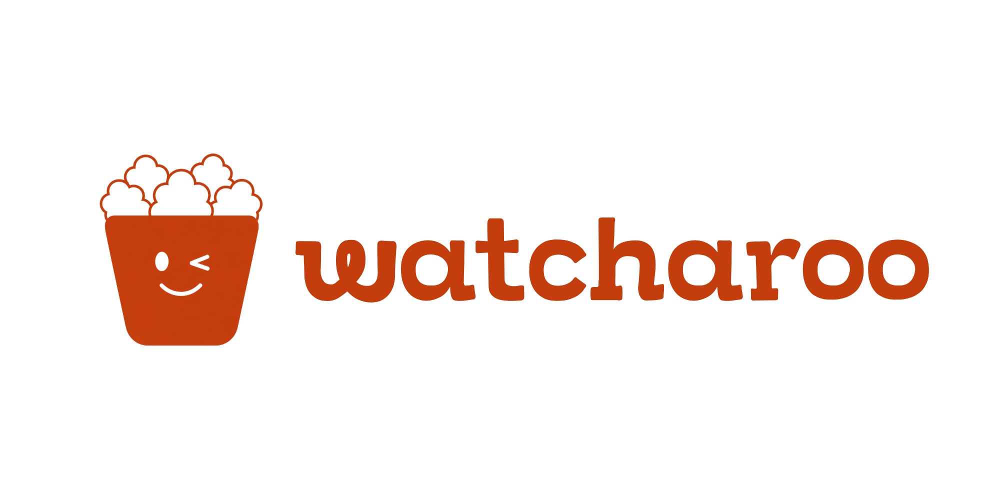
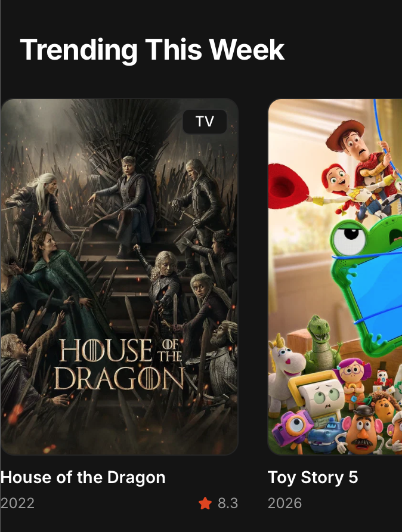

<p align="center">
  
</p>

<p align="center">
  <strong>Find where to watch, instantly.</strong><br/>
  Search any movie or TV show and see exactly which streaming services carry it — in your country.
</p>

<p align="center">
  
  
  
  
  
  
</p>

---

## What is Watcharoo?

Watcharoo is a **fully static** streaming service finder. No backend, no database — just a fast, cinematic-dark React app that calls the TMDB API directly from the browser.

Type in any movie, TV show, or documentary. Watcharoo instantly shows you:
- Which streaming services carry it (Netflix, Prime Video, Disney+, Apple TV+, and more)
- Whether it's available to **stream**, **rent**, or **buy**
- All of this filtered to **your country** — because availability differs everywhere

---

## Screenshots

### Home


### Trending & Popular rows with live TMDB data
> Cards show poster, title, year, rating, and media type badge. Click any card to go to its detail page.

---

## Features

| Feature | Detail |
|---|---|
| 🔍 **Multi-search** | Searches movies and TV shows simultaneously |
| 📺 **Where to Watch** | Streaming, rent & buy options per country |
| 🌍 **Country selector** | 34 countries — auto-detected from your IP |
| 🎬 **Detail pages** | Backdrop, cast, trailers, genres, rating, similar titles |
| 📈 **Trending & Popular** | Live weekly trending + quality-filtered popular picks |
| 🎨 **Dark-only UI** | Cinematic dark theme, Inter font, smooth animations |
| ⚡ **Fully static** | No server — deployable to Vercel or Netlify for free |

---

## Tech Stack

| Layer | Technology |
|---|---|
| Framework | React 19 + Vite 7 |
| Language | TypeScript 5.9 |
| Styling | Tailwind CSS 4 + shadcn/ui |
| Routing | wouter |
| Data fetching | TanStack React Query |
| Animations | Framer Motion |
| UI Icons | lucide-react |
| Brand Icons | react-icons/si |
| API | [TMDB v3](https://developer.themoviedb.org/docs) |
| Package manager | pnpm workspaces |

---

## Getting Started

### 1. Clone the repo

```bash
git clone https://github.com/your-username/watcharoo.git
cd watcharoo
pnpm install
```

### 2. Get a TMDB API key

1. Create a free account at [themoviedb.org](https://www.themoviedb.org)
2. Go to **Settings → API → Create → Developer**
3. Copy your **Read Access Token** (starts with `eyJ...`)

### 3. Set the environment variable

Create a `.env` file in the project root:

```env
VITE_TMDB_TOKEN=your_read_access_token_here
```

> ⚠️ Never commit this file. It's already in `.gitignore`. The token is baked into the browser bundle at build time — keep this in mind for public deployments.

### 4. Run locally

```bash
pnpm --filter @workspace/watcharoo run dev
```

Open `http://localhost:<port>` — the port is shown in the terminal.

---

## Deploy to Vercel

Watcharoo is designed for free static hosting on Vercel.

### Steps

1. Push the repo to GitHub
2. Import the project at [vercel.com/new](https://vercel.com/new)
3. Set the **Root Directory** to `artifacts/watcharoo`
4. Add an **Environment Variable**:
   - Name: `VITE_TMDB_TOKEN`
   - Value: your TMDB Read Access Token
5. Deploy

Vercel will auto-detect Vite and configure the build (`vite build`) and output directory (`dist`) correctly.

---

## Project Structure

```
watcharoo/
├── artifacts/
│   └── watcharoo/              ← Main web app
│       ├── src/
│       │   ├── lib/tmdb.ts     ← TMDB API client & types
│       │   ├── pages/          ← Home, Search, MovieDetail, TVDetail
│       │   ├── components/     ← Navbar, Footer, MediaCard, WatchProviders, CountrySelector
│       │   └── hooks/
│       │       └── useCountry.ts  ← IP detection + localStorage
│       └── index.html
├── attached_assets/            ← Logos & brand assets
└── pnpm-workspace.yaml
```

---

## API Notes

All data comes from the [TMDB API](https://developer.themoviedb.org/docs). Key endpoints used:

- `GET /trending/all/week` — Trending this week
- `GET /discover/movie` — Quality-filtered popular movies (`vote_average ≥ 7`, `vote_count ≥ 500`)
- `GET /discover/tv` — Quality-filtered popular TV
- `GET /search/multi` — Multi-search
- `GET /movie/{id}/watch/providers` — Streaming availability by country
- `GET /tv/{id}/watch/providers` — Streaming availability by country

---

## Legal

<p>
  This product uses the TMDB API but is not endorsed or certified by TMDB.<br/>
  <a href="https://themoviedb.org" target="_blank">
    
  </a>
</p>

All film data is sourced from [The Movie Database (TMDB)](https://themoviedb.org) with permission.

---

<p align="center">
  <br/>
  Made with ❤️ by <a href="https://efenow.xyz">efenow.xyz</a>
</p>
